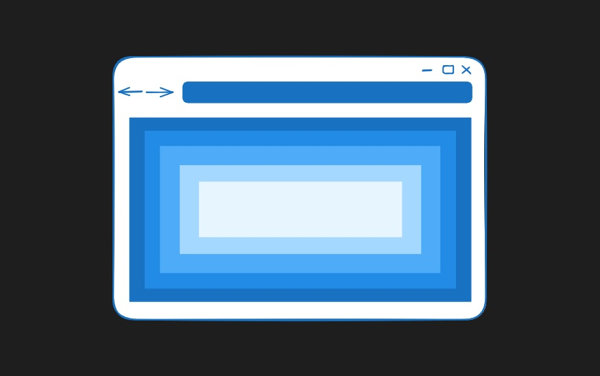

Recommending browsers with a focus on privacy and security for digitalnisvobody.cz

{fig-alt="Simple drawing depicting a browser window"}

I wrote a blog post for [IuRe's Digital Freedoms program](https://digitalnisvobody.cz/digital-freedom/) about browser recommendations. The main focus of the article was to recommend a few browsers with strong privacy and security defaults to a general audience and provide tips with the biggest marginal benefits on how to improve one's online experience.

::: {.callout-tip}

## Link to the blog post (in Czech)
<https://blog.digitalnisvobody.cz/2026/09/02/prohlizece26/>
:::

Thank you to the team for the opportunity to write this.

