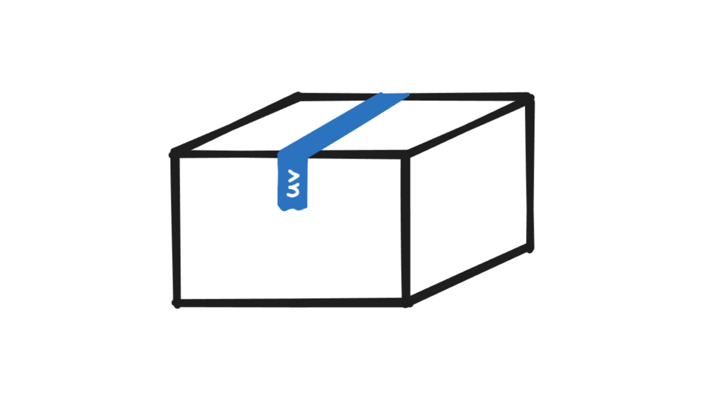

A walkthrough of how to build your custom Python package using `uv` without publishing it (2026 update).

{fig-alt="Taped up box with uv written on the tape"}

Blink and you'll miss it. [Astral's `uv`](https://docs.astral.sh/uv/) is a performant package & project manager that's out to replace all the competing tools.

In this blog post, I'll walk you through a minimal example of how to build your own Python package **without uploading it to the internet**. While it's great to get feedback from others when sharing your code, there may be simple reasons why that might not be desirable. For instance, if you're building an internal package at work or testing something out, it's usually not for sharing.

## Get started

Let's start by installing `uv` on your machine. There are multiple installation methods outlined in the `uv` documentation. Perhaps the most convenient method is to use the [standalone installer](https://docs.astral.sh/uv/getting-started/installation/#standalone-installer).

Once `uv` is installed (v0.12.5 used), choose a folder where you want your project to be, open your terminal of choice and initialize the project by running:

```sh
uv init
```

Now, the directory of your project should look like this:

```sh
my_internal_pkg/
├── src/
│   └── my_internal_pkg/
│       └── __init__.py
├── .gitignore
├── .python-version
├── pyproject.toml
└── README.md
```

As we can see, `uv init` created multiple files and a folder while also initializing the project as a `git` repository.

**The important file to focus on is `pyproject.toml`** which is used to configure the project that you initialized just a moment ago. Let's take a peek at the default structure of this file:

```toml
[project]
name = "my_internal_pkg"
version = "0.1.0"
description = "Add your description here"
readme = "README.md"
authors = [
    { name = "Your Name", email = "your@email" }
]
requires-python = ">=3.12"
dependencies = []

[project.scripts]
my_internal_pkg = "my_internal_pkg:main"

[build-system]
requires = ["uv_build>=0.12.5,<0.13.0"]
build-backend = "uv_build"
```

Most of the settings in your `pyproject.toml` are generated and managed by `uv`. Of course, all settings in this text file can be modified manually. Let's leave these settings unchanged for now.

## Package contents

As a minimal example, let me create a simple Python script that calculates rolling minimum and maximum values for a given column in a `polars` dataframe. If you're unfamiliar with `polars`, consider reading [my guide](https://rnd195.github.io/posts/my-pd-pl-guide/) on how to get started with `polars` as a `pandas` user. 

First, let's install `polars` and set it as a dependency for the package. Open up the terminal in the project's folder and run:

```sh
uv add polars
```

This command installs the package in a virtual environment (`.venv` folder) and modifies `pyproject.toml` by adding `polars` as a dependency. If we take a look at the `pyproject.toml` file now, the `dependencies` setting should look like this

```toml
dependencies = [
    "polars>=1.43.2",
]
```

Now, let's write the function that calculates rolling min and max values—I'm going to place this function in a script named `df_helpers.py`. Here's the updated file tree:

```sh
my_internal_pkg/
├── src/
│   └── my_internal_pkg/
│	    ├── __init__.py
│	    └── df_helpers.py
├── .gitignore
├── .python-version
├── pyproject.toml
└── README.md
```

Keeping it really simple, below is the rolling min max function I placed in the `df_helpers.py` Python script:

```python
import polars as pl


def rolling_min_max(df: pl.DataFrame, col: str, window: int = 3) -> pl.DataFrame:
    """Get rolling min and max values of a specific column"""
    return df.with_columns(
        pl.col(col).rolling_min(window_size=window).alias(f"{col}_roll_min"),
        pl.col(col).rolling_max(window_size=window).alias(f"{col}_roll_max")
    )
```

Now that we have something to turn into a package, we're almost set. There are some final touches we need to make to the `pyproject.toml` file.

## Finalizing `pyprojects.toml`

Since this tutorial is aimed at building your package locally, consider adding `classifiers = ["Private :: Do Not Upload"]` into the `[project]` section in the config file. This labels the package as "private" and adds another layer of defense against accidentally publishing your package to the official PyPI repository (see [link](https://pypi.org/classifiers/)).

We're almost at the finish line. For completeness, the final `pyproject.toml` file should look like this:

```toml
[project]
name = "my_internal_pkg"
version = "0.1.0"
description = "Add your description here"
readme = "README.md"
authors = [
    { name = "Your Name", email = "your@email" }
]
requires-python = ">=3.12"
dependencies = [
    "polars>=1.43.2",
]
classifiers = ["Private :: Do Not Upload"]

[project.scripts]
my_internal_pkg = "my_internal_pkg:main"

[build-system]
requires = ["uv_build>=0.12.5,<0.13.0"]
build-backend = "uv_build"

```

## Build

With `pyproject.toml` set up, we should now be able to build the package. What's going to happen now is that the build command will create a folder named `dist/` in the project's directory. Inside this folder, we're going to see our package in a `.tar.gz` (source distribution) and `.whl` (wheel) format. While the difference between these is beyond the scope of this post, if you're going to be distributing your package locally—to other colleagues or your other systems—consider using the `.whl` file because it simplifies the process of installing the package. Note that both of these are ultimately archives, so you can take a look inside each to see the differences. To learn more about this topic, I would recommend reading [this excellent article on Real Python](https://realpython.com/python-wheels/).

**Enough stalling, let's build the package.** Open up your terminal in the project's directory, and run:

```sh
uv build
```

If successful, the `dist/` folder should pop up and the two distributions should be inside:

```sh
dist/
├── .gitignore
├── my_internal_pkg-0.1.0.tar.gz
└── my_internal_pkg-0.1.0-py3-none-any.whl
```

## Install

To install the package, grab the `.whl` file and place it wherever you need it installed. You can use `uv` to install the package by running

```sh
uv add "path/to/my_internal_pkg-0.1.0-py3-none-any.whl"
```

## That's it?

**That's it.** We've built a Python package from scratch using `uv`.

You should now be able to import your package in the environment you installed it in using

```python
import my_internal_pkg
```

This was just a minimal example of how to get started building packages. Consider browsing through repositories of popular Python packages to see how they do it. Additionally, for a tutorial on how to publish your package, take a look at [`uv` docs](https://docs.astral.sh/uv/guides/package/).

If you have any suggestions or corrections, feel free to let me know in the comments on GitHub! 


<br/> [Comment on GitHub](https://github.com/rnd195/rnd195.github.io-comments/issues/4){.btn .btn-secondary title="Comment on GitHub" .bi-chat target="_blank"}