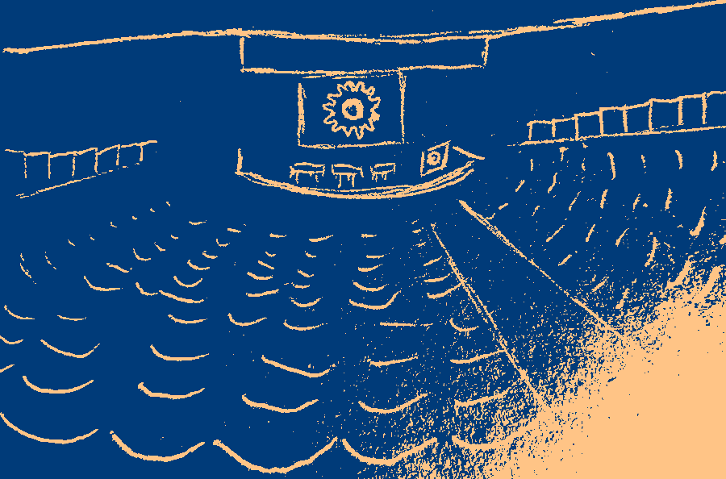

Briefly reflecting on my first-ever attendance of the FOSDEM conference

## About the event and my takeaways

FOSDEM[^fosdem] is the largest conference about free and open source software.[^largest] This year's event was held for the 25th time in the first two days of February, and I was fortunate enough to be attending. It was my first time participating in the event, and what I was initially struck by (in a positive way) was the conference's turnout. In fact, so many people showed up to the event that, on several occasions throughout the first day, my connection to the cellular network had trouble keeping up.

Among other things, the event consisted of talks/lectures/panels on topics such as Android, Python, Security, and 70+ other *tracks*.[^tracks] I overheard some people describing the event as *chaotic* and while I get that the sheer size of the conference could give this impression, I feel like calling it "chaotic" takes away from the impressive level of planning and organization demonstrated by the team behind the conference. For instance, each talk was streamed live and recorded, every block that I attended was on schedule, the event even had companion apps, and so much more.

The topics that I was mainly interested in were centered around data science, Python, as well as legal & policy. I particularly enjoyed the panel discussion on what it means for an *AI system* or a machine learning model to be free/open.[^panel] It was also great to meet some of the people behind the PyArrow[^arrow] package—I typically use PyArrow for data storage via the `.parquet` file format, and while this is only a small portion of the package's capabilities, I consider it to be such a time (& disk space) saver. Last but not least, I attended a talk about commercially viable companies that focus on developing open source software and what it takes to be respected by the open source community.[^companies] 

## A first-timer's tips for future first-timers

Before the introductory keynote speech began, I asked an experienced FOSDEM-goer who sat next to me for tips on how to get the most out of the conference. The gentleman said that there is no wrong way to experience the event, and it's really up to each attendee to make the most out of it. 

From my experience, it's best to be prepared for the highly likely possibility that you won't be able to visit all the talks that you planned to visit due to time and room capacity constraints. Therefore, I would suggest choosing a few developer rooms that you can retreat to if things don't go according to the plan. Each talk is live-streamed and recorded (available a week or so after the event), so I wouldn't really worry about missing a particular talk. I think that the added value of this event is that it is in-person. I would instead focus on that.

For more tips and insights about the event in general, allow me to recommend [this detailed write-up](https://ounapuu.ee/posts/2024/02/12/fosdem-2024/) on the `./techtipsy` blog about last year's event.

[^fosdem]: <https://fosdem.org/>
[^largest]: <https://fosdem.org/2025/schedule/event/fosdem-2025-6712-welcome-to-fosdem-2025/>, 5:40
[^tracks]: <https://fosdem.org/2025/schedule/#devrooms>
[^panel]: <https://fosdem.org/2025/schedule/event/fosdem-2025-6639-panel-when-is-an-ai-system-free-open-/>
[^arrow]: <https://fosdem.org/2025/schedule/event/fosdem-2025-6092-what-can-pyarrow-do-for-you-array-interchange-storage-compute-and-transport/>
[^companies]: <https://fosdem.org/2025/schedule/event/fosdem-2025-5320-build-a-great-business-on-open-source-without-selling-your-soul/>

  [Comment on GitHub](https://github.com/rnd195/rnd195.github.io-comments/issues/2){.btn .btn-secondary title="Comment on GitHub" .bi-chat target="_blank"}