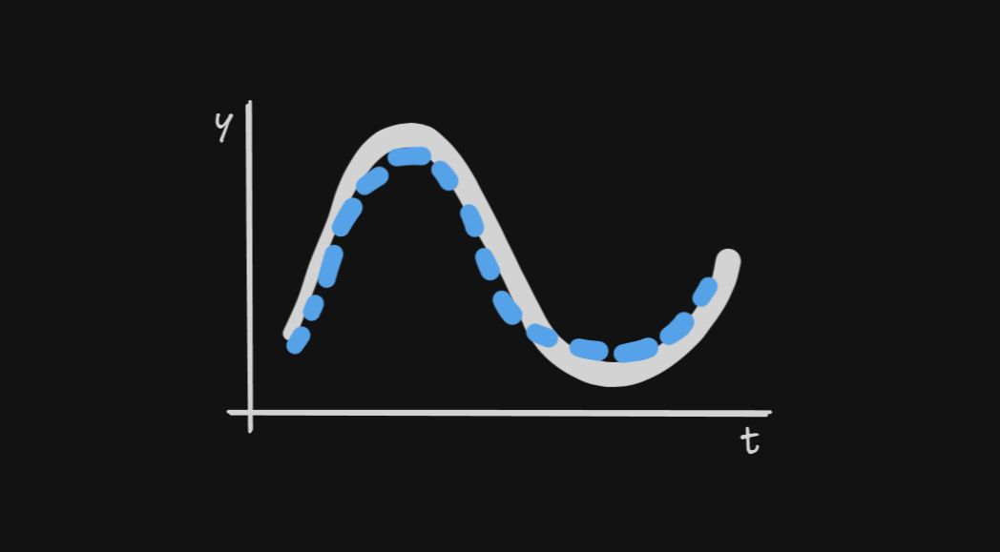
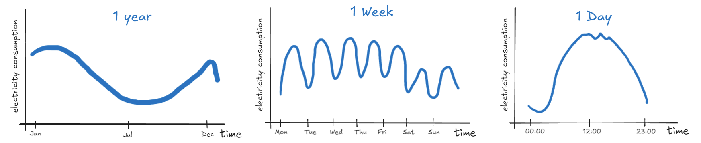
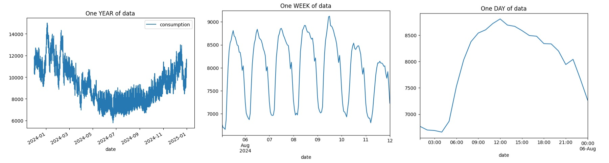
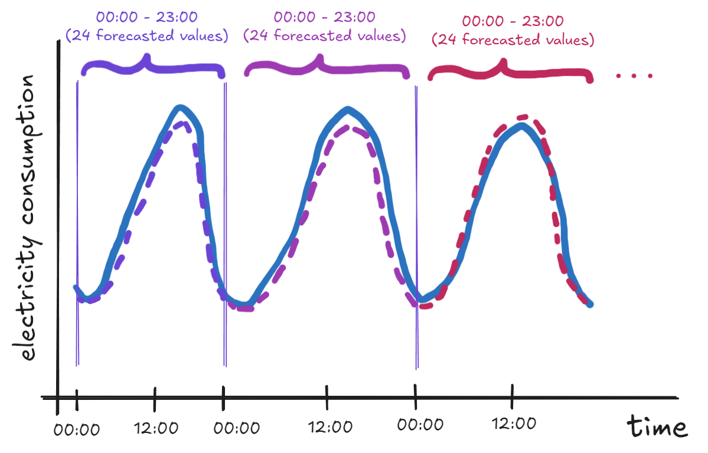
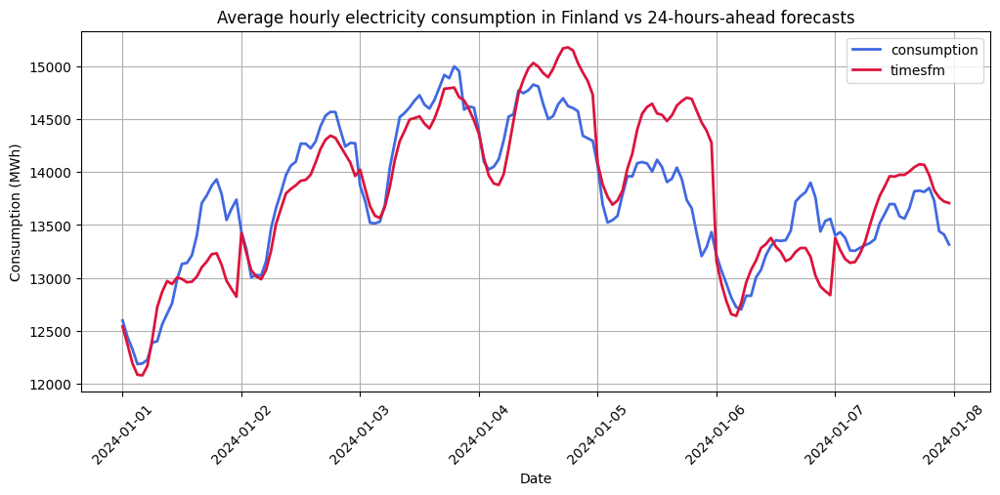
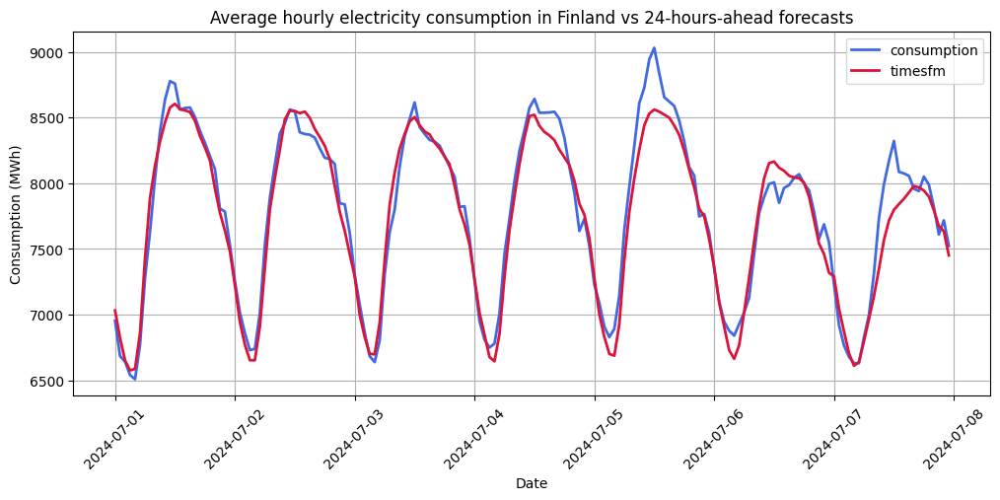
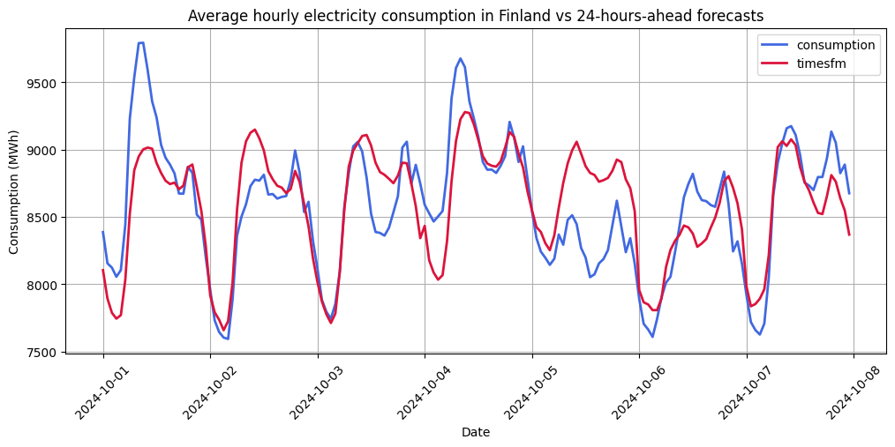
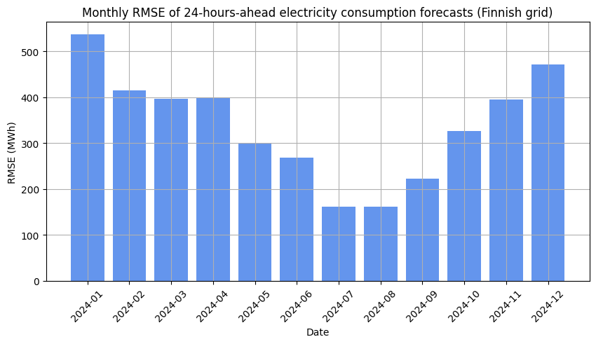

Generating forecasts of Finnish electricity consumption using the TimesFM 200M model by Google Research



In early 2024, Google Research announced TimesFM, a ***pre-trained univariate time-series foundation*** model for ***time-series forecasting***.[^tfm-blog] First, let me break down the terminology. The general idea is that this is a model for sequences of data that are ordered in time (***time-series***). A few examples of time-series include: annual inflation rate, monthly precipitation, weekly water demand, or hourly temperatures. This being a ***forecasting*** model simply means that we are interested in predicting the future. ***Univariate*** implies that this model only takes in and outputs a single time-series—in other words, no other variables are utilized. ***Pre-trained*** means, for our purposes, that we don't need to run the complex process of training the model. We simply download a large file that contains all the 200M parameters for the model to produce forecasts. Finally, a ***foundation*** model is one that has been pre-trained on a large number of diverse datasets.[^foundation] 

To be honest, when I first read about this model, I realized that I have never used a pre-trained time-series model. And it's not like these didn't exist before. In fact, several pre-trained foundation models have been released (see, for example[^pretrained]). But seeing Google Research announce their pre-trained time-series forecasting model put this whole category of models on my radar. 

In their paper on TimesFM,[^paper] the authors tested the model's performance on popular time-series datasets and demonstrated that TimesFM was, in the majority of cases, able to outperform both classical and deep learning models using their methodology. For this reason, I was interested in knowing how well it would forecast something I am familiar with—electricity consumption.


## Data

Specifically, I decided to use electricity consumption data from the operator of the Finnish grid through their Open Data portal.[^data] At this point, I believe that it is important to give my words of appreciation to the people at Fingrid for providing easy access to the data with clear license terms. In my view, this is the way open data should be done, so thank you!

From my experience, electricity consumption in (most of?) Europe typically follows these three major seasonal patterns:

{#fig-simple}

Firstly, there's typically high electricity consumption in winter, lowering in spring, low during summer months, and slowly climbing upward in autumn. Note that the dip at the end of the year is due to winter holidays and it can be quite substantial. Secondly, on a typical work week, the Monday to Friday pattern looks fairly similar, but there is lower electricity consumption during the weekend. Finally, if we look at a single day's worth of electricity consumption data, there will likely be less electricity consumed at night and consumption will peak around midday, perhaps in the afternoon, or early evening.

If we look at hourly electricity consumption in Finland (resampled from 15-min by averaging), I can cherry-pick specific weeks or days to make the series look similar to the patterns illustrated above. However, the full 2024 snapshot makes it clear that electricity consumption patterns in Finland are more nuanced.

{#fig-cons}

## Setup

I will be benchmarking the 200M parameter model on the whole 2024 hourly consumption data illustrated above. Naturally, we already know what the 2024 electricity consumption looks like, but it would be highly impractical to produce forecasts from the current point in time onward while waiting for the future to materialize to collect the data and determine the accuracy of our predictions. Instead, we can go step by step, limiting the *knowledge* our forecasting model takes in, generate forecasts at that point in time, and immediately compare against the actual values. This is called *pseudo-out-of-sample* forecasting (see, for example[^oos]).

In electricity consumption forecasting, it often makes sense to think about the data in full days, not just individual hours. Therefore, I will be forecasting up to 24 hours ahead following the scheme described below:

- Start on Jan 1st 2024, 00:00 – this will be the first prediction

- With no knowledge of electricity consumption on Jan 1st, produce forecasts up to 23:00 (included)

- Save these forecasts and move by one day
- Generate predictions for Jan 2nd (00:00, 01:00, …, 23:00)
- Move by one day
- Continue until you reach Dec 31st 2024

Below is an illustration of the scheme—the three vertical lines are the starting points for each 24-hour prediction as well as a knowledge-cutoff line. The dashed curves illustrate predictions while the solid line is meant to represent actual values that are not "seen" by the model beforehand. 

{#fig-scheme}

To produce the forecasts, I am using the official `timesfm` [Python package](https://github.com/google-research/timesfm) and the package-specific code only really takes a few lines if we leave all other hyperparameters set to their default values.

```python
# Up to 24 hours ahead
horizon = 24
# Define model parameters
model_params = timesfm.TimesFmHparams(
    backend="gpu",
    horizon_len=horizon
)
# Load checkpoint from huggingface
hf_checkpoint = timesfm.TimesFmCheckpoint(
    huggingface_repo_id="google/timesfm-1.0-200m-pytorch"
)
# Setup the model
model = timesfm.TimesFm(
    hparams=model_params,
    checkpoint=hf_checkpoint
)
```

Assuming that our data is stored in a `pandas` DataFrame, we can produce forecasts by running

```python
fcst = model.forecast_on_df(
    # Formatted dataframe
    inputs=df,
    # Data frequency (hourly)
    freq="h",
    # Target variable column name
    value_name="consumption",
    # -1 sets the number of processes to cpu count
    num_jobs=-1
)
```

And that's about it. You may find the whole implementation in a Jupyter notebook linked in the floating table of contents on the right.

## Results

Firstly, let me briefly summarize the setup and all the parameters used to generate the forecasts:

- Data
  - electricity consumption in Finland in MWh
  - hourly frequency (resampled from 15-min by averaging)
  - start 2024-01-01 00:00, end 2024-12-31 23:00 (excluding some missing values)
- Forecasting scheme
  - up to 24 hours ahead
  - start at 00:00, generate predictions up to 23:00 each day, and move to the next day

- Model
  - TimesFM 200M with default parameters


### Plots

For visual convenience, I connected all the forecasts into a single series. However, let me once again note that the predictions were generated for each day separately (denoted by the vertical gridlines). 

With that in mind, let's take a look at some of the forecasts (in red) versus actual values (in blue), starting in the first week of Jan 2024:

{#fig-jan}

My first thoughts are that the model is somewhat capable of capturing the general day/night pattern as well as the rough daily consumption level (with some exceptions). However, it seems to struggle with the shape of the peak hours (midday/afternoon) for most days of the week. Of course, this is just a single week out of the whole year, but these symptoms appear to be prevalent in most weeks of the year as suggested by the monthly error metrics displayed later (@fig-mape and @fig-rmse).

Below is a snapshot of early July 2024 forecasts:

{#fig-jul}

This is a totally different story as it seems that the model was capable of generating relatively accurate forecasts. This can likely be attributed to the less volatile pattern of electricity consumption in the summer months of 2024 which is certainly helpful for univariate models.

Finally, let's take a look at a sample from October 2024:

{#fig-oct}

In this case, we get similar issues with the shape and sometimes even the level as in the first displayed plot. Interestingly, perhaps due to the autoregressive nature of the model, it was able to capture the distinct "U" shape of the peak consumption.

### Error metrics

Using the forecasting scheme outlined above, the 200M TimesFM model with default parameters was capable of recording the following accuracy metrics on the 2024 Finnish electricity consumption data 

| Metric (total)                        | Value         | Explainer                                                    |
| ------------------------------------- | ------------- | ------------------------------------------------------------ |
| Mean absolute percentage error (MAPE) | 2.659%        | On average, how much does a single point forecast deviate from actual values in absolute terms. Denoted in % |
| Root mean square error (RMSE)         | 356.89071 MWh | On average, how much does a single point forecast deviate from actual values in squared terms. Larger mistakes are penalized more. Denoted in MWh |
| R-squared                             | 95.817%       | This can help determine shape accuracy, but not level        |
| Mean bias error                       | 18.25352 MWh  | Overestimation (+) or underestimation (-), on average        |

Let's also take a look at MAPE and RMSE grouped by month to get a better picture of which months were easier to forecast with the model.


::: {layout-ncol=2}
{#fig-mape}

{#fig-rmse}
:::

It is clear that the 200M TimesFM model was the most accurate in July and August which can partly be seen in @fig-jul as discussed earlier. In terms of RMSE, the least accurate forecasts were generated in the first month of 2024. 

## Thoughts

While I cannot confidently comment on the relative levels of these error metrics with respect to Finnish data due to a lack of experience with Finnish electricity consumption, **I find these results impressive** for a univariate model that doesn't need to be trained. It is without a doubt that multivariate models would outperform this framework in this particular forecasting exercise. Still, I think it is valuable to benchmark the model on data that is known to be *forecastable* as it may help us understand what we can expect from the framework in other domains.

Regardless, I am now very interested in future foundation time-series models that Google Research may release. Perhaps this is a sign of what's to come in the time-series forecasting domain? I hope so. On that note, the TimesFM [repository on GitHub](https://github.com/google-research/timesfm) has recently been updated with a 500M variant. Would this model generate more accurate forecasts in the exercise outlined in this post? It's possible but that is a question for another time.


[^tfm-blog]: Google Research (2024). A decoder-only foundation model for time-series forecasting. <https://research.google/blog/a-decoder-only-foundation-model-for-time-series-forecasting/>
[^pretrained]:  For instance <https://github.com/qianlima-lab/time-series-ptms?tab=readme-ov-file#pre-trained-models-on-time-series-forecasting>
[^foundation]: See, for example <https://www.ibm.com/think/topics/foundation-models>
[^paper]: Das, A., Kong, W., Sen, R., & Zhou, Y. (2023). A decoder-only foundation model for time-series forecasting. *arXiv preprint arXiv:2310.10688*. <https://arxiv.org/abs/2310.10688>
[^data]: ["Electricity consumption in Finland"](https://data.fingrid.fi/en/datasets/124) provided by [Fingrid](https://data.fingrid.fi/en) is licensed under [CC BY 4.0](https://creativecommons.org/licenses/by/4.0/)
[^oos]: Hanck, C., Arnold, M., Gerber, A., & Schmelzer, M. (2024). Introduction to Econometrics with R. <https://www.econometrics-with-r.org/14.8-niib.html#pseudo-out-of-sample-forecasting>

